# 여보, 나 왔어

어젯밤 회식에서 만취해 집에 못 들어간 아빠 개미가, 아내의 메신저 폭격을 받으며 거대한 사람들의 발 사이를 뚫고 심부름을 마치고 귀가하는 **3D 캐주얼 코믹 스텔스 어드벤처**입니다.

| 항목 | 내용 |
|---|---|
| 장르 · 플랫폼 | 3인칭 스텔스 어드벤처 · 싱글플레이 · Windows/PC |
| 엔진 | Unity 6000.3.15f1 (URP) · C# |
| 기간 | 2026-05 ~ 2026-09 (프로토타입 → 1st/2nd/3rd 빌드) |
| 개발 | 1인 개발 — 기획 · 프로그래밍 · 연출 · UI (프로젝트명 `개미 심부름`) |

> 외부 에셋(`Assets/minigame-project-assets-smflsmfqh/`)은 라이선스상 **별도 private 저장소(git 서브모듈)** 로 관리합니다.
> 이 저장소만으로는 씬이 온전히 열리지 않으며, 코드·데이터·문서 열람용입니다.

---

## 게임 소개

**"밟히기 전에, 아내가 폭발하기 전에 집에 가자"** — 분노 게이지 × 발·고양이·차 3종 위협 × 상점 심부름

- **분노 게이지가 곧 제한시간.** 아내의 분노는 매초 차오르고, 심부름 하나를 완수할 때마다 줄어듭니다. 10·25·50·75·90% 임계값마다 아내의 메시지가 날아오고, 100%가 되면 "짐은 쌌다. 문은 잠겼다." — 게임 오버.
- **3종 위협.** 인도를 걷는 사람들의 발(패트롤러 / 러너), 개미를 발견하면 쫓아오는 고양이, 신호에 맞춰 도로를 달리는 자동차. 각각 다른 사망 메시지와 표정 리액션이 있습니다.
- **심부름.** 약국·아이스크림 고정 미션 + 랜덤 그룹(아보카도/바나나 · 달걀/버섯 · 피자/도넛)에서 하나씩 + 진행 중 추가되는 보너스 미션. 상점 앞에 들어서면 아이템이 떨어지고 `E`로 줍습니다. 모두 마치면 히든 미션 **꽃다발**이 열립니다.
- **길거리 음식.** 쓰레기통 주변에 무작위로 떨어지는 음식은 회복 · 무적 · 속도 증가 버프. 시작 시 걸린 **숙취 디버프**는 약국의 숙취해소제로 풀립니다.
- **승리** 모든 심부름 완료 후 개미굴 귀가 / **패배** 체력 0 · 분노 100% · 심부름 미완료 상태로 귀가

| 조작 | 키 |
|---|---|
| 이동 · 시점 | `W` `A` `S` `D` · 마우스 |
| 달리기 · 점프 · 구르기 · 웅크리기 | `Shift` · `Space` · `R` · `C` |
| 아이템 줍기 | `E` |
| 심부름 목록 · 일시정지 | `Tab` · `Esc` |
| 튜토리얼 스킵 | `Q` |

## 스크린샷

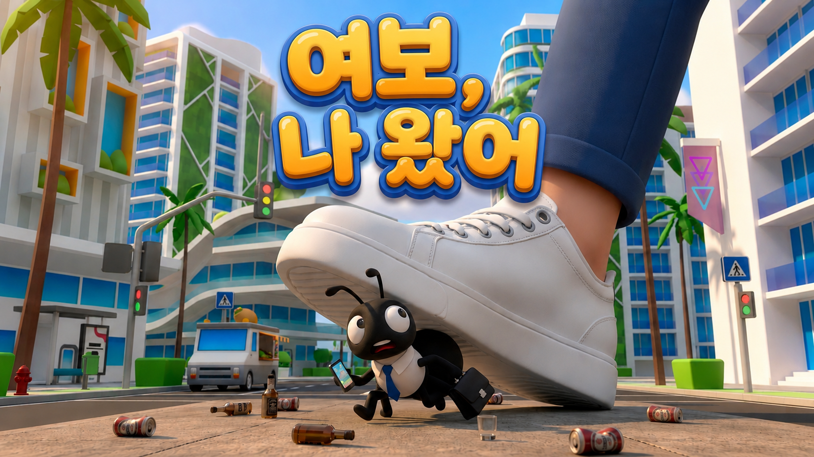

| | |
|:--:|:--:|
| 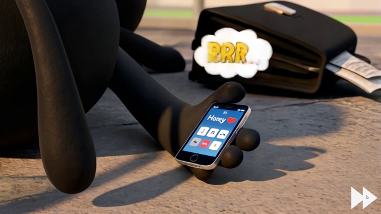 | 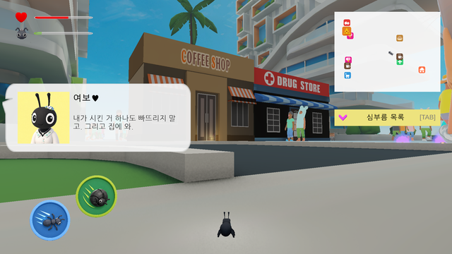 |
| 오프닝 영상 (타이틀 씬 `VideoPlayer` 재생): 아내의 메시지 폭격 | 인게임 HUD: 메시지 · 체력/스프린트 · 미니맵 · 심부름 목록 |
| 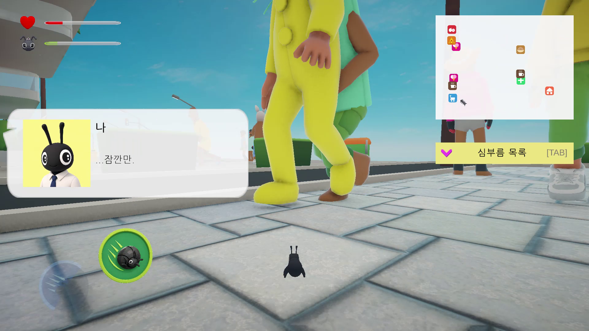 | 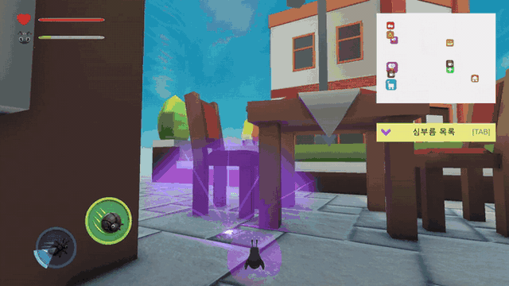 |
| 개미 시점의 스케일감: 발 사이를 지나가기 | 아이템 획득: 드랍 지점 파티클 → `E` 픽업 → 리액션 컷 + 효과 파티클 |
| 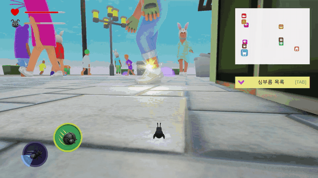 | 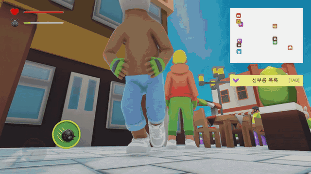 |
| 미션 아이템 픽업 → 체크리스트 완료 표시 → 발에 밟힘(리액션 컷 · 표정 변화) | 스프린트로 발 사이 빠져나가기 (게이지 소모) |
| 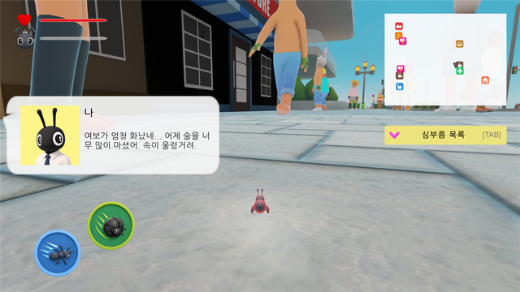 | 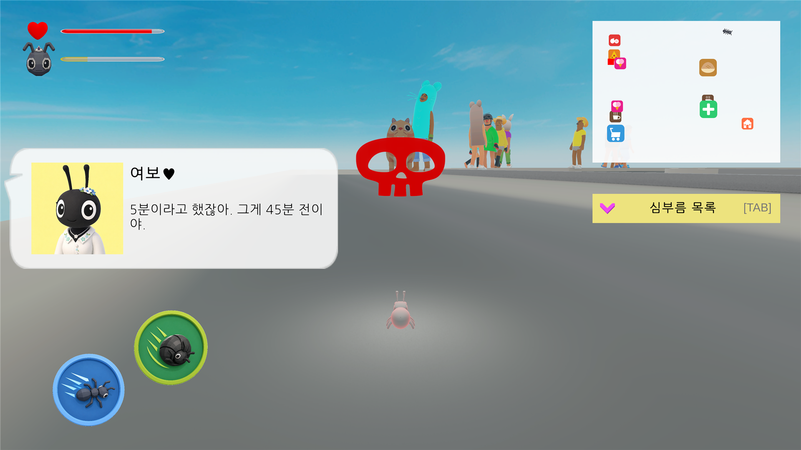 |
| 게임 시작: 숙취 디버프(반투명 깜빡임) 상태로 발 사이를 지나기 | 고양이와 조우 + 아내 분노 메시지("5분이라고 했잖아…") |
| 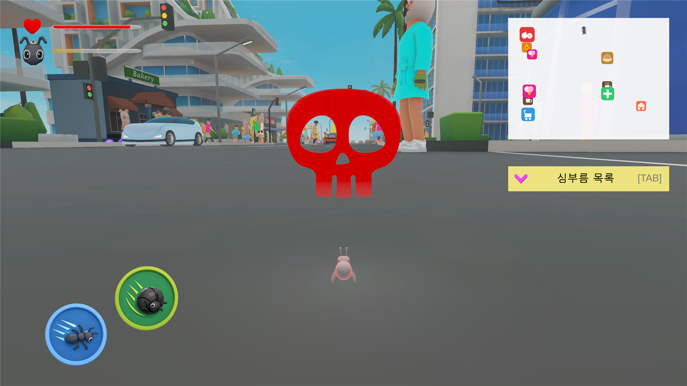 | 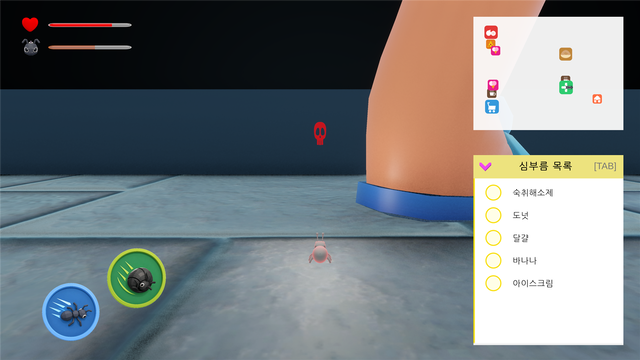 |
| 도로 위: 지나가는 차와 횡단보도 인파 사이 | 심부름 목록(`Tab`): 랜덤으로 구성된 이번 판 목록 |
| 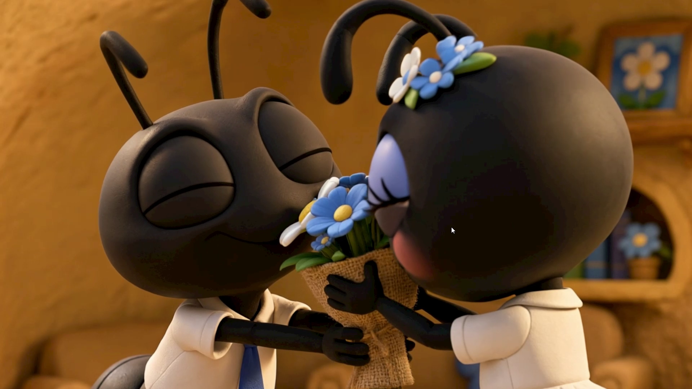 | 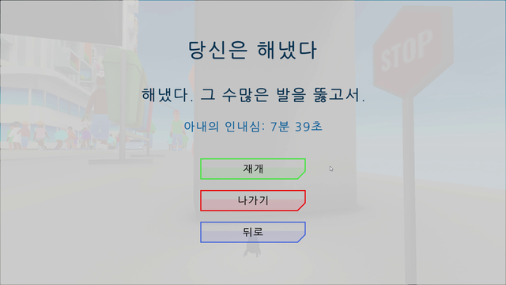 |
| 히든 엔딩 영상 (꽃다발까지 완수하고 귀가하면 재생) | 클리어 화면: "아내의 인내심" = 생존 시간 |

- 아이템 효과 데이터 구조: [`Docs/Images/readme/item_effect_so_diagram.svg`](Docs/Images/readme/item_effect_so_diagram.svg)

---

## 주요 시스템

**개미의 이동과 카메라**(Rigidbody 이동, 구르기·웅크리기, 리액션 컷 카메라), **3종 NPC 위협**(사람·고양이·차량과 NavMesh 스폰), **심부름·분노 루프**(시간 기반 미션 배분, 분노 게이지, 귀가 판정), **아이템·상점**(ScriptableObject 효과, 상점 드랍, 길거리 음식), **UI·연출**(메시지 큐, 미니맵, 근접 피드백, 다국어), **튜토리얼**을 전부 직접 구현했습니다.

### 1. 플레이어 — [`PlayerMovement`](Assets/Scripts/Player/PlayerMovement.cs) · [`PlayerController`](Assets/Scripts/Player/PlayerController.cs) · [`PlayerHealth`](Assets/Scripts/Player/PlayerHealth.cs) · [`FollowCamera`](Assets/Scripts/FollowCamera.cs) ([`Assets/Scripts/Player`](Assets/Scripts/Player))

- **이동** — Rigidbody 기반 WASD, 접촉 법선을 모아 경사면·연석에서도 미끄러지지 않게 처리. 달리기(`Shift`, 7초 게이지 소모/회복), 점프, 구르기(`R`, 0.7초 무적 + 5초 쿨다운), 웅크리기(`C`, 콜라이더 높이 축소). 이동 모드는 `MoveMode` 상태로 관리하고 게이지 변화는 이벤트(`OnSprintChanged`, `OnRollChanged`)로만 UI에 전달합니다.
- **체력** — 피격 25(발) / 10(고양이), 피격 후 0.7초 무적, 2초마다 자동 회복. 사망 원인은 [`CauseDeath`](Assets/Scripts/Data/CauseDeath.cs) enum으로 넘겨 원인별 사망 메시지·표정·게임오버 처리를 분기합니다.
- **표정 · 리액션** — 피격 원인에 따라 `Eyes_Cry / Eyes_Shrink / Eyes_Trauma` 등 얼굴 애니메이션을 재생하고, [`FollowCamera`](Assets/Scripts/FollowCamera.cs)가 리액션 컷(정면 클로즈업)으로 잠시 전환됩니다.
- **숙취 디버프** — [`HangoverEffect`](Assets/Scripts/Player/HangoverEffect.cs): 시작 시 이동 속도 ×0.6 + 반투명 깜빡임 머티리얼 + 파티클. 약국의 숙취해소제 미션 완료 이벤트를 받으면 원래 머티리얼로 복구합니다.
- **저체력 비네팅** — [`VignetteHealthController`](Assets/Scripts/Player/VignetteHealthController.cs): 체력 50% 이하부터 10% 단위 5단계로 URP Volume 비네팅 강도를 올립니다.

### 2. NPC 3종 · 스폰 — [`NPCMovement`](Assets/Scripts/NPC/Human/NPCMovement.cs) · [`CatMovement`](Assets/Scripts/NPC/Cat/CatMovement.cs) · [`CarMovement`](Assets/Scripts/NPC/Car/CarMovement.cs) ([`Assets/Scripts/NPC`](Assets/Scripts/NPC))

- **사람** — NavMeshAgent 기반 `Patrol`(느림·긴 대기) / `Runner`(빠름·짧은 대기) 두 타입. 스폰 존 사각형 안에서 목적지를 무작위로 잡고 `Road`·`Not Walkable` 영역은 마스크로 제외, 1.5초 이상 정지하면 stuck으로 판정해 재경로. 발 콜라이더([`FootStompCollider`](Assets/Scripts/NPC/FootStompCollider.cs))가 개미를 밟으면 데미지 + 거리 기반 발소리.
- **고양이** — 배회하다 시야 범위에 개미가 들어오면 추격, 머리 콜라이더([`CatHeadDamage`](Assets/Scripts/NPC/Cat/CatHeadDamage.cs))로 5초 쿨다운 데미지. 튜토리얼용 고양이는 별도 플래그로 수명을 제한합니다.
- **자동차** — 경로점을 따라 도로를 순환하며, [`CrosswalkWaitZone`](Assets/Scripts/NPC/Human/CrosswalkWaitZone.cs)이 차량 신호(8초) ↔ 보행자 신호(5초)를 번갈아 돌려 횡단보도에서 사람과 차가 서로 대기합니다. 경적은 개미와의 거리에 따라 볼륨이 변합니다.
- **스폰** — [`NPCSpawnManager`](Assets/Scripts/NPC/Human/NPCSpawnManager.cs)가 존별로 풀을 만들어 `Walkable` NavMesh 위에만 배치하고, [`NPCVisualizeCustomizer`](Assets/Scripts/NPC/Human/NPCVisualizeCustomizer.cs)가 피부·머리·옷 색을 가중치 랜덤으로 조합해 같은 프리팹이 반복되어 보이지 않게 합니다. 고양이·차량도 각자 스폰 매니저를 가집니다.

### 3. 심부름 · 분노 루프 — [`MissionManager`](Assets/Scripts/MissionManager.cs) · [`AngerSystem`](Assets/Scripts/AngerManager.cs) · [`Destination`](Assets/Scripts/Destination.cs) · [`GameManager`](Assets/Scripts/GameManager.cs)

- **미션 풀 구성** — 고정 미션(각자 해금 시각) + 랜덤 그룹별 후보 1개(해금 시각은 Fisher-Yates로 셔플해 배분) + A·B 그룹 중 하나의 탈락 후보를 **보너스 미션**으로 예약(미션 2개 완료 후 30초 뒤 할당). 시간순으로 정렬해 게임 중 순차 할당되며, 전부 완료하면 히든 미션(꽃)이 열립니다. 매 플레이마다 목록이 달라집니다.
- **분노 게이지** — 초당 +1.5, 최대 200. 미션 완료 시 -20. 임계값(10/25/50/75/90%)을 넘길 때마다 `ANGER_n` 키로 아내 메시지를 발화하고, 가득 차면 `CauseDeath.Anger`로 게임 오버.
- **귀가 판정** — 개미굴 트리거([`Destination`](Assets/Scripts/Destination.cs))는 세 갈래: 전부 완료 → 클리어 / 아직 할당 안 된 미션이 있음 → "너무 일찍 왔다" 경고 / 할당됐지만 미완료 → 게임 오버.
- **게임 흐름** — [`GameManager`](Assets/Scripts/GameManager.cs)가 플레이 시간·일시정지·클리어/오버 화면·재시작(재시작 시 튜토리얼 자동 스킵)을 관리하고, 결과 화면에 생존 시간을 "아내의 인내심"으로 표시합니다.

### 4. 아이템 · 상점 — [`ItemData`](Assets/Scripts/Data/ItemData.cs) · [`ItemEffectSO`](Assets/Scripts/Data/ItemEffetSO/ItemEffectSO.cs) · [`ShopBuilding`](Assets/Scripts/Item/ShopBuilding.cs) · [`TrashDropper`](Assets/Scripts/Item/TrashDropper.cs) ([`Assets/Scripts/Item`](Assets/Scripts/Item), [`Assets/Scriptables`](Assets/Scriptables))

- **데이터 기반 아이템** — 아이템 하나가 [`ItemData`](Assets/Scripts/Data/ItemData.cs)(이름·드롭 프리팹·카테고리 `Food/Mission/Optional`·효과 배열), 효과는 추상 [`ItemEffectSO`](Assets/Scripts/Data/ItemEffetSO/ItemEffectSO.cs)를 상속한 [`HealEffectSO`](Assets/Scripts/Data/ItemEffetSO/HealEffectSO.cs) / [`InvincibleEffectSO`](Assets/Scripts/Data/ItemEffetSO/InvincibleEffectSO.cs) / [`SpeedBoostEffectSO`](Assets/Scripts/Data/ItemEffetSO/SpeedBoostEffectSO.cs). 새 효과는 SO 하나를 추가하고 배열에 끼우면 끝이며, 효과별 파티클 타입도 SO가 들고 있습니다. ([다이어그램](Docs/Images/readme/item_effect_so_diagram.svg))
- **상점 드랍** — [`ShopData`](Assets/Scripts/Data/ShopData.cs)에 상점별 드롭 목록을 두고, 개미가 상점 앞 트리거에 들어오면 목록에서 하나를 뽑아 문 앞에 떨어뜨립니다. 미션 아이템은 **해당 미션이 할당된 뒤에만** 나오며, 드랍 후 쿨다운(미션 10초 / 음식 5초)을 [`CooldownBarUI`](Assets/Scripts/UI/CooldownBarUI.cs)로 보여 줍니다. 미션 할당·표시 이벤트에 따라 상점 스팟 파티클과 미니맵 핑을 켜고 끕니다.
- **픽업** — [`PlayerController`](Assets/Scripts/Player/PlayerController.cs)가 반경 1m `OverlapSphere`로 [`IInteractive`](Assets/Scripts/Item/IInteractive.cs)를 찾아 `E`로 상호작용. [`MissionItem`](Assets/Scripts/Item/MissionItem.cs)은 카테고리별 미니맵 마커 색을 정하고, 풀링된 음식 아이템은 수명이 다하면 자동 반환됩니다.
- **길거리 음식** — [`TrashDropper`](Assets/Scripts/Item/TrashDropper.cs)가 쓰레기통 주변 반경에 20~60초 간격으로 음식을 떨어뜨립니다. 레이캐스트로 바닥을 찾고 장애물과 겹치면 최대 15회 재시도.

### 5. UI · 피드백 — [`MissionMessageUI`](Assets/Scripts/UI/MissionMessageUI.cs) · [`MinimapUI`](Assets/Scripts/UI/MinimapUI.cs) · [`ProximityFeedback`](Assets/Scripts/ProximityFeedback/ProximityFeedback.cs) · [`StringTableManager`](Assets/Scripts/StringTableManager.cs) ([`Assets/Scripts/UI`](Assets/Scripts/UI))

- **메시지 큐** — 아내 메시지·독백·힌트·튜토리얼 문구가 전부 한 큐를 지나갑니다. 표시 시점에 CSV 키를 다시 조회하므로 언어를 바꿔도 화면의 메시지가 즉시 재번역되고, 튜토리얼은 큐 맨 앞에 끼워 넣는 API를 씁니다.
- **미니맵** — 월드 XZ → 패널 좌표 변환, 마커 타입(플레이어/상점/아이템/목적지)별 아이콘·색, 미션 할당 시 해당 상점 마커 **핑**. `LateUpdate` 순회 중 제거는 대기열로 미뤄 컬렉션 변경 예외를 피합니다.
- **근접 피드백** — `Danger` 태그 오브젝트와의 최소 거리를 `intensity(0~1)`로 환산해 이벤트로 발행. 카메라 흔들림([`FollowCamera`](Assets/Scripts/FollowCamera.cs)), 화면 패널 연출([`ProximityPanelFeedbackUI`](Assets/Scripts/UI/ProximityPanelFeedbackUI.cs)), 차량 경적 볼륨이 각자 독립적으로 구독합니다.
- **다국어** — [`StringTableManager`](Assets/Scripts/StringTableManager.cs)가 `Resources/Data/ko.csv`, `en.csv`를 로드. 키·문구·발신자·프로필 이미지 키를 한 줄로 두어 사망 메시지(원인별 랜덤), 분노 메시지, 미션 메시지를 모두 데이터로 관리하며, 타이틀에서 언어를 고르면 `PlayerPrefs`로 유지됩니다.
- 체력·스프린트·구르기 게이지, 심부름 체크리스트(`Tab`), 볼륨 설정(AudioMixer), 일시정지/클리어/게임오버 패널 — [`UIManager`](Assets/Scripts/UI/UIManager.cs)

### 6. 튜토리얼 · 타이틀 — [`TutorialManager`](Assets/Scripts/Tutorial/TutorialManager.cs) · [`TitleController`](Assets/Scripts/TitleController.cs)

- NPC·고양이·차량·분노·미션 배분을 모두 멈춘 상태에서 시작해 **이동 → 시점 → 조작 안내 → 튜토리얼 고양이 등장(웅크리기) → 게임 재개 → 첫 미션(약국) → 지도·방향 화살표 → 숙취해소제 픽업 → 목표 안내** 순으로 진행합니다. 각 단계는 메시지 슬라이드 완료·플레이어 이동 거리·트리거 진입·픽업 이벤트로 넘어가며, 안내보다 먼저 해 버린 행동(약국 선진입, 선픽업)도 놓치지 않도록 콜백을 먼저 등록합니다. `Q`로 스킵.
- 타이틀 씬은 오프닝 영상(`VideoPlayer`) → 언어 선택 → 게임 시작. 재시작 시에는 튜토리얼을 자동으로 건너뜁니다.

### 7. 맵 · 에디터 작업

- 도시 맵 NavMesh 베이크(`Walkable` / `Road` / `Not Walkable` 영역 분리), 도로·인도 콜라이더 정리, 라이팅 굽기
- [`MapColliderSetup`](Assets/Editor/MapColliderSetup.cs) — 도로 타일 종류별로 연석 콜라이더를 일괄 생성하는 에디터 창(미리보기 모드 포함). 개미가 도로 타일에서 공중에 뜨거나 연석에 걸리는 문제를 수작업 대신 툴로 해결했습니다.
- 타이틀·오프닝·엔딩 영상, UI 아이콘·버튼 스프라이트, 파티클(상점 스팟·아이템 획득·버프) 배선

---

## 작업하면서 지킨 원칙

- **데이터는 ScriptableObject / CSV로** — 아이템·효과·상점 드롭 목록은 SO, 모든 대사·메시지는 언어별 CSV. 밸런스와 문구는 코드 수정 없이 바꿉니다.
- **판정은 한 곳에서** — 미션 완료·분노 감소·상점 파티클·미니맵 핑은 전부 `MissionManager` 이벤트 하나에서 갈라져 나옵니다. 각 시스템이 상태를 따로 추적하지 않습니다.
- **이벤트 구독은 `OnEnable`/`OnDisable`(또는 `OnDestroy`) 쌍으로** — 싱글톤 실행 순서는 `[DefaultExecutionOrder]`로 명시.
- **코루틴 대신 UniTask** — 상점 쿨다운, 아이템 수명 등 취소가 필요한 대기는 `CancellationTokenSource`를 들고 파괴 시 취소.
- **채널 독립** — 근접 피드백처럼 여러 연출이 같은 값을 쓰는 경우 `float` 이벤트만 발행하고, 카메라·UI·사운드는 서로를 모릅니다.

## 기술 스택

Unity 6000.3.15f1 · URP 17.3 · Input System 1.19 · AI Navigation 2.0 · UniTask · DOTween · TextMesh Pro

## 실행

1. 저장소를 클론한 뒤 `git submodule update --init`으로 에셋 서브모듈을 받습니다 (private — 접근 권한 필요).
2. Unity 6000.3.15f1로 프로젝트를 엽니다.
3. `Assets/Scenes/TitleScene.unity`를 열고 Play — 오프닝 영상 후 언어를 고르고 게임(`AntDemoScene`)으로 진입합니다.

## 사용 에셋

| 용도 | 에셋 |
|---|---|
| 개미 (플레이어 · 아내) | Quirky Series — Ant |
| 도시 · 놀이터 | Cartoon City Free, SimplePoly City, Playground Low Poly, Palmov Island |
| 사람 NPC | Creative Characters Free Animated Pack |
| 음식 · 소품 | FoodPack, Food Free, ToyObjectsPack, TDG Italian Ice |
| 이펙트 · 셰이더 · UI | Epic Toon FX, PolygonParticleFX, JMO Assets (Cartoon FX), SilverShader, Flat Black Universal GUI |

> 위 에셋은 `Assets/minigame-project-assets-smflsmfqh/` 서브모듈(private)에 있으며 이 저장소에는 포함되지 않습니다.
